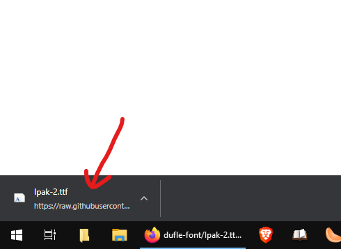
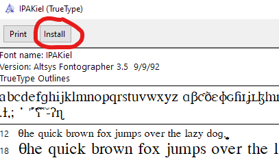

Title: How to Install the Required Font for Module 1

- Download the font by [clicking here](files/Ipak-2.ttf).
- Once the font is downloaded, open the downloaded file by clicking on the button in the bottom-left corner of the screen:

- When you open the file, you will see a window like the following:

- Click on the "Install" button on the top left:

That's all folks!